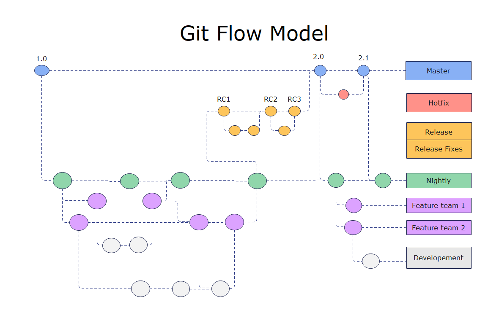
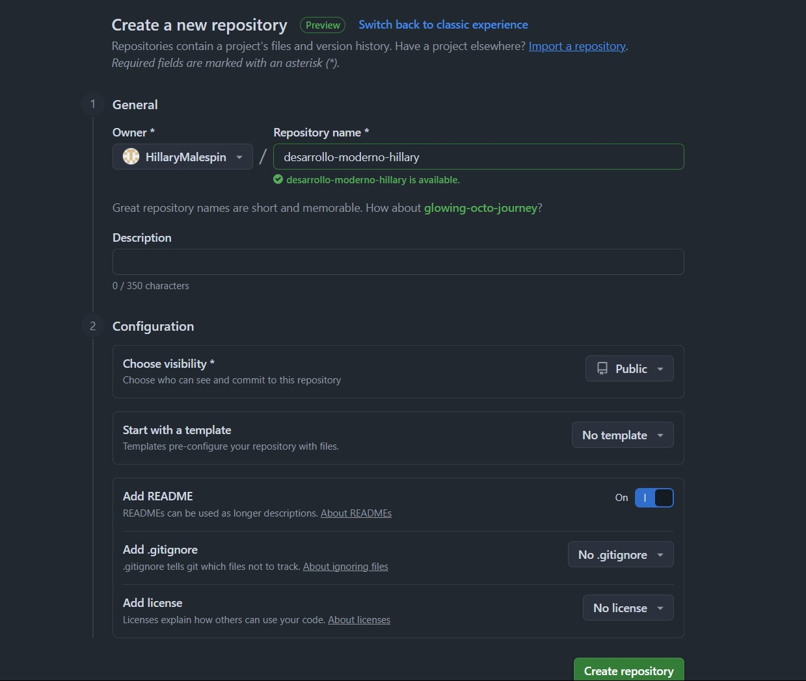
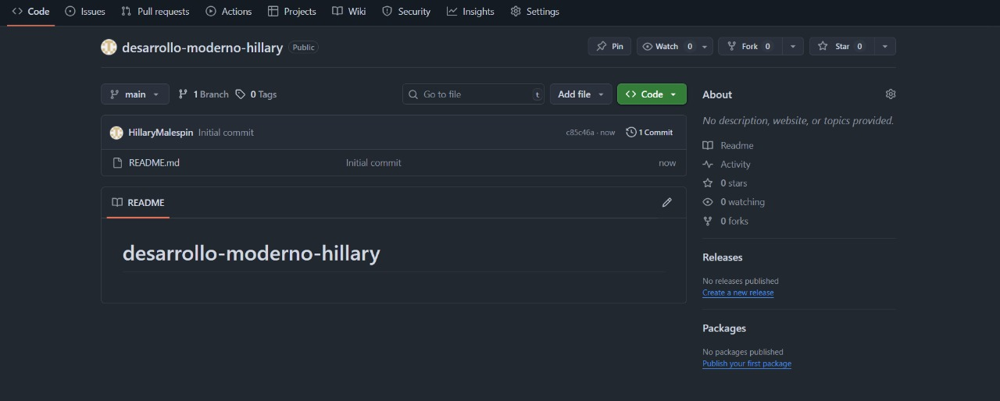
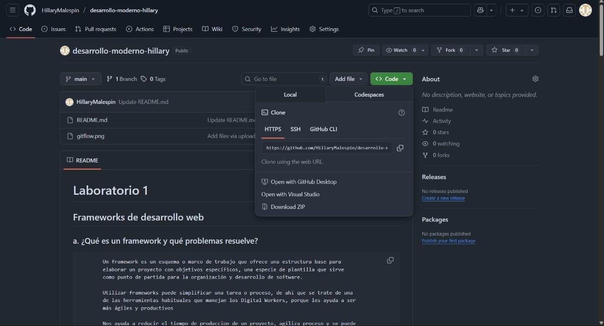
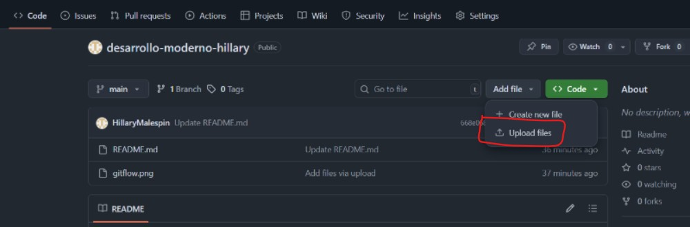
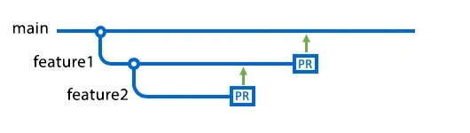
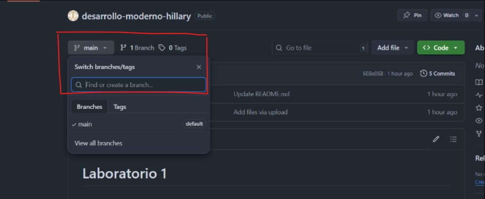
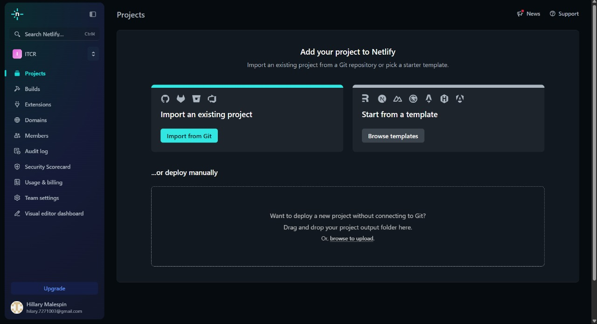
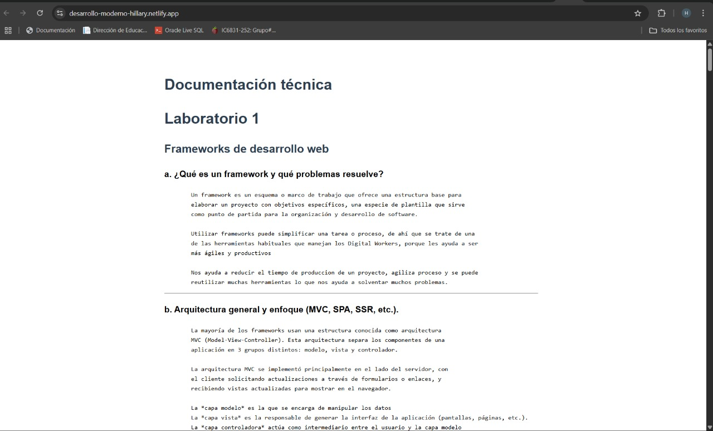

# Laboratorio 1

## Frameworks de desarrollo web

   ### a. ¿Qué es un framework y qué problemas resuelve?
            Un framework es un esquema o marco de trabajo que ofrece una estructura base para 
            elaborar un proyecto con objetivos específicos, una especie de plantilla que sirve 
            como punto de partida para la organización y desarrollo de software.

            Utilizar frameworks puede simplificar una tarea o proceso, de ahí que se trate de una 
            de las herramientas habituales que manejan los Digital Workers, porque les ayuda a ser 
            más ágiles y productivos

            Nos ayuda a reducir el tiempo de produccion de un proyecto, agiliza proceso y se puede
            reutilizar muchas herramientas lo que nos ayuda a solventar muchos problemas.

---

   ### b. Arquitectura general y enfoque (MVC, SPA, SSR, etc.). 
            La mayoría de los frameworks usan una estructura conocida como arquitectura 
            MVC (Model-View-Controller). Esta arquitectura separa los componentes de una 
            aplicación en 3 grupos distintos: modelo, vista y controlador.
            
            La arquitectura MVC se implementó principalmente en el lado del servidor, con 
            el cliente solicitando actualizaciones a través de formularios o enlaces, y 
            recibiendo vistas actualizadas para mostrar en el navegador.

            La *capa modelo* es la que se encarga de manipular los datos
            La *capa vista* es la responsable de generar la interfaz de la aplicación (pantallas, páginas, etc.).
            La *capa controladora* actúa como intermediario entre el usuario y la capa modelo

--- 

   ### c. Ejemplo práctico documentado (estructura de proyecto, fragmento de codigo comentado)
   ### Estructura del proyecto 
            /mvc-example
            /models
                Product.php 
            /views
                products.php
            /controllers
                ProductController.php
            index.php
### Fragmento de codigo comentado

```javascript
    //Modelo
    class Product {
        public function getAllProducts() {
            // Simulación de datos (en producción, usa una base de datos real)
            return [
                ['id' => 1, 'name' => 'Producto A', 'price' => 10.00],
                ['id' => 2, 'name' => 'Producto B', 'price' => 15.50],
            ];
        }
    }
```
```javascript
//Controlador
require_once 'models/Product.php';

class ProductController {
    public function index() {
        $model = new Product();
        $products = $model->getAllProducts();
        require_once 'views/products.php';
    }
}
```

```javascript
//Vista
<!DOCTYPE html>
<html lang="es">
<head>
    <meta charset="UTF-8">
    <title>Lista de Productos</title>
    <style> ul { list-style: none; } li { margin: 5px 0; } </style>
</head>
<body>
    <h1>Productos Disponibles</h1>
    <ul>
        <?php foreach ($products as $product): ?>
            <li><?php echo htmlspecialchars($product['name']) . " - $" . number_format($product['price'], 2); ?></li>
        <?php endforeach; ?>
    </ul>
</body>
</html>
```
---

   ### d. Comparación breve entre al menos dos frameworks (según lenguaje o enfoque). 
   ### ASP.NET MVC:
   ***Arquitectura:***
            ASP.NET MVC es un framework de Microsoft para construir aplicaciones web utilizando el patrón MVC. 
            Se integra con .NET Framework y .NET Core, permitiendo desarrollo multiplataforma. 
            
   ***Enfoque:***
    
            Se enfoca en la separación de preocupaciones, facilitando el desarrollo y mantenimiento de aplicaciones 
            web complejas. Ofrece flexibilidad y control sobre la estructura de la aplicación. 
            
   ***Ventajas:***
    
            Flexibilidad: Permite personalizar la forma en que se manejan las solicitudes, la lógica de negocio y la presentación. 
            Facilidad de testing: La separación de capas facilita la creación de pruebas unitarias y de integración. 
            Comunidad y soporte: Amplia comunidad y documentación, especialmente con ASP.NET Core. 
            
   ***Desventajas:***
    
            Complejidad: Puede resultar complejo para proyectos pequeños o simples debido a su flexibilidad. 
            Curva de aprendizaje: Requiere tiempo para dominar los conceptos y la estructura del framework. 

   ### Spring MVC:
   ***Arquitectura:***
            Spring MVC es un componente del framework Spring para Java, también basado en el patrón MVC.
            
   ***Enfoque:***
            Similar a ASP.NET MVC, Spring MVC promueve la separación de preocupaciones y la modularidad en el desarrollo 
            de aplicaciones Java.
            
   ***Ventajas:***
            Productividad: Ofrece características como inyección de dependencias y soporte para desarrollo basado en 
            anotaciones, lo que agiliza el desarrollo.
            Reutilización de código: Facilita la reutilización de componentes y la creación de aplicaciones modulares.
            Amplia comunidad y ecosistema: Cuenta con una gran comunidad de desarrolladores Java y un ecosistema rico en 
            bibliotecas y herramientas.
         
            
   ***Desventajas:***
            Curva de aprendizaje: Similar a ASP.NET MVC, Spring MVC puede tener una curva de aprendizaje pronunciada 
            para nuevos usuarios.
            Overhead: El framework puede agregar complejidad y sobrecarga a proyectos pequeños. 

   ***Comparación:***
            ASP.NET MVC se basa en C# y .NET, mientras que Spring MVC se basa en Java. 

## Control de versiones y trabajo colaborativo

  ### a. ¿Qué es el control de versiones y por qué es esencial? 
            Es la práctica de rastrear y gestionar los cambios en el código de software. Los sistemas de control de 
            versiones son herramientas de software que ayudan a los equipos de software a gestionar los cambios en el 
            código fuente a lo largo del tiempo. 
 
 ---

   ### b. Conceptos clave: repositorio, commit, branch, merge, pull request. 

**Repositorio:** Un repositorio es un lugar donde se guarda y organiza información 
            digital, como documentos o archivos informáticos.

**Commit:** Se usa para guardar los cambios en el repositorio local. 
            Crea un nuevo objeto de confirmación, que actúa como una instantánea 
            de los archivos del proyecto en un momento dado. 

**Branch:** Las ramas de Git son un puntero eficaz para las instantáneas de 
            tus cambios. Cuando quieres 
            añadir una nueva función o solucionar un error, independientemente de su 
            tamaño, generas una nueva 
            rama para alojar estos cambios.

**Merge:** Permite tomar las líneas independientes de desarrollo creadas por git 
            branch e integrarlas en una sola rama.

**Pull request:** Se usa para cargar contenido del repositorio local a un repositorio 
            remoto. El envío es la forma de transferir confirmaciones desde tu repositorio local 
            a un repositorio remoto.

---

   ### c. Flujos de trabajo comunes (Git Flow, trunk-based, feature branches). 

**Gitflow:** Es un modelo alternativo de ramificación de Git que implica el uso de ramas 
            de características y múltiples ramas principales.



            Trunk-based: El desarrollo basado en tronco es una práctica de gestión de control de versiones en la que 
            los desarrolladores fusionan pequeñas actualizaciones de forma frecuente en un “tronco” o rama principal (main).
            Dado que esta práctica simplifica las fases de fusión e integración, ayuda a lograr la CI/CD (Continuous 
            Integration / Continuous Deployment, siendo estos la Integración Continua y Despliegue Continuo) y, al 
            mismo tiempo, aumenta la entrega de software y el rendimiento de la organización.

            Feature branches: La idea central del flujo de trabajo de rama de funciones es que todo el desarrollo de 
            funciones se realice en una rama dedicada, en lugar de en la mainrama principal. Esta encapsulación facilita 
            que varios desarrolladores trabajen en una función específica sin afectar el código base principal. Además, 
            significa que la mainrama nunca contendrá código defectuoso, lo cual supone una gran ventaja para los entornos 
            de integración continua.

---

   ### d. Ejemplo de cómo usar Git en un proyecto (inicialización, commits, ramas). 

   ### 1. Iniciamos creando un proyecto en Github

            Aquí agregamos el ***nombre del proyecto*** una ***descripcion*** breve si se requiere, 
            también podemos decididir la ***visibilidad*** del proyecto, si lo queremos publico o 
            privado, y también si queremos que se genere un archivo ***README.md***

   ### 2. Proyecto creado

            Una vez que creamos nuestro proyecto se ve de esa manera.

   ### 3. Clonar proyecto

            Podemos tener nuestro repositorio de forma local y editarlo, podemos hacerlo de dos 
            formas. Una es descargando el ZIP de nuestro proyecto y descomprimirlo en una carpeta
            en nuestro ordenador. O también podemos utilizar un comando de git para clonarlo 
            directamente con el URL de nuestro proyecto en git:

```javascript
//EJEPLO DE USO
git clone https://github.com/HillaryMalespin/desarrollo-moderno-hillary.git
```
   ### 4. Commits

            Podemos hacer commits manualmente utilizando add file desde github o 
            podemos usar el comando *** git commit *** en nuestra consola.

   ### 5. Branch

            Si no estás seguro/a de cuál es la rama en la que estás trabajando, 
            utiliza el comando git branch.  Si muestra la rama master, cambiaremos a la rama main ejecutando el comando git branch –M main.
            Si queremos crear un branch podemos hacerlo con el comando ***git branch nombre-de-la-rama*** o también
            de forma manual en github.

        Y podemos eliminar una rama con el comando ***git branch -d nombre-de-la-rama***
    
--- 

   ### e. Herramientas recomendadas (GitHub, GitLab, Bitbucket). 
 

### Herramienta recomendada: GitHub

**Descripción:**  
GitHub es una plataforma de alojamiento de código basada en la nube que utiliza el sistema de control de versiones Git. Permite a los desarrolladores almacenar, gestionar, versionar y colaborar en proyectos de software desde cualquier lugar.  

**Ventajas:**  
- **Popularidad y comunidad amplia:** Es la plataforma más utilizada a nivel mundial, con millones de repositorios y usuarios.  
- **Integraciones:** Compatible con herramientas de CI/CD, despliegue automático, y una gran variedad de servicios externos.  
- **GitHub Pages:** Permite publicar sitios web estáticos directamente desde un repositorio.  
- **Colaboración:** Facilita el trabajo en equipo mediante *Pull Requests*, revisiones de código y seguimiento de *issues*.  
- **Seguridad:** Ofrece escaneo de vulnerabilidades y protección de ramas.  

**Aplicación en el laboratorio:**  
En este laboratorio, GitHub puede utilizarse para:  
1. Crear un repositorio remoto para almacenar el proyecto.  
2. Gestionar el control de versiones y el trabajo colaborativo.  
3. Publicar el sitio web usando **GitHub Pages** o integrarlo con **Netlify** para el despliegue automático.  

**Enlace oficial:** [https://github.com](https://github.com)

### 4. Gestores de contenido desacoplados (Headless CMS)

#### a. Definición de Headless CMS vs CMS tradicional

Un **CMS tradicional** (o acoplado/monolítico) combina la gestión del contenido y su presentación en una sola plataforma, ofreciendo editores visuales y plantillas integradas (por ejemplo, WordPress, Drupal). 
En contraste, un **Headless CMS** es un sistema de gestión de contenido *solo backend* que separa el contenido de la capa de presentación. No incluye una interfaz frontal; en su lugar, entrega el contenido a través de APIs para que cualquier frontend (sitios web, apps móviles, IoT…) lo consuma. 

---

#### b. Arquitectura basada en APIs

- En un **Headless CMS**, el contenido se almacena y administra en el backend. Luego, se expone mediante APIs (como REST o GraphQL), y cualquier frontend puede consumirlo y presentarlo a los usuarios. Esta arquitectura es ideal para experiencias omnicanal. 

---

#### c. Ventajas, limitaciones y casos de uso comunes

| **Ventajas** | **Limitaciones** |
|--------------|------------------|
| • Permite entregas omnicanal (sitios, apps, dispositivos IoT)  | • Requiere más esfuerzo y conocimientos de desarrollo para configurar frontends  |
| • Flexibilidad en el frontend: se puede usar cualquier framework o lenguaje | • No ofrece vistas previas integradas (aunque algunos sistemas lo permiten mediante integraciones adicionales) |
| • Mayor seguridad: al no exponer la base de datos ni el backend al frontend | • Puede implicar mayores costes por licencias, infraestructura y desarrollo inicial |
| • Escalabilidad y rendimiento mejorados |  |
| • Permite reutilizar contenido en múltiples canales desde una única fuente  |  |

**Casos de uso comunes:**
- Proyectos que requieren publicar contenido en múltiples plataformas (landing page, app móvil, pantallas IoT, etc.) 
- Equipos con desarrolladores frontend capaces que desean libertad para elegir tecnologías modernas (React, Vue, etc.) 
- Sitios que necesitan alta seguridad, rendimiento y escalabilidad (ecommerce, medios digitales, enterprise)

---

#### d. Ejemplo de cómo se conecta el frontend a un CMS headless. 

            Un CMS headless se conecta al frontend mediante APIs, permitiendo que el frontend 
            consuma contenido del CMS sin estar acoplado directamente a él. El frontend,
            construido con tecnologías como React, Angular o Vue.js, realiza solicitudesa la 
            API del CMS para obtener datos y mostrarlos en la interfaz de usuario. 

### Ejemplo de conexión de un frontend a un Headless CMS

En este ejemplo usaremos **JavaScript** para consumir datos de un CMS headless (por ejemplo, Strapi) mediante su API REST.

**1. URL del CMS**  
Supongamos que el CMS está disponible en:
https://mi-cms.com/api/articulos


**2. Código de ejemplo (JavaScript)**  
```html
<!DOCTYPE html>
<html>
<head>
  <title>Ejemplo Headless CMS</title>
</head>
<body>
  <h1>Lista de artículos</h1>
  <ul id="lista-articulos"></ul>

  <script>
    fetch('https://mi-cms.com/api/articulos')
      .then(response => response.json())
      .then(data => {
        const lista = document.getElementById('lista-articulos');
        data.forEach(articulo => {
          const li = document.createElement('li');
          li.textContent = articulo.titulo;
          lista.appendChild(li);
        });
      })
      .catch(error => console.error('Error al obtener datos:', error));
  </script>
</body>
</html>
```

3. Explicación:

    El CMS headless expone el contenido a través de una API.

    El frontend hace una petición HTTP para obtener los datos en formato JSON.

    El contenido se muestra en la página sin necesidad de tener el CMS y el frontend en el mismo sistema.

### 5. Pasarelas de pago en aplicaciones web (Costa Rica)

#### a. ¿Qué es una pasarela de pago? ¿Qué rol cumple en una aplicación moderna?
Una **pasarela de pago** es un servicio tecnológico que permite procesar pagos en línea de manera segura entre el cliente, la aplicación web y las entidades financieras. En aplicaciones modernas, facilita una experiencia de compra fluida, captura los datos de pago, los encripta y los transmite al proveedor de pagos para autorización inmediata.

---

#### b. Requisitos comunes
- **Cuenta de comercio:** Necesaria en algunos proveedores para recibir fondos, aunque plataformas como PayPal administran este flujo internamente.  
- **Seguridad y normativas:** Se utiliza cifrado (TLS) y se requiere cumplimiento de estándares como PCI DSS para proteger los datos.  
- **Integración técnica:** Se realiza mediante APIs, SDKs, y entornos de prueba (*sandbox*) antes del lanzamiento en producción.

---

#### c. Ventajas y limitaciones de integrar pagos en línea

| Ventajas | Limitaciones |
|----------|--------------|
| Facilita una experiencia de pago rápida y cómoda. | Puede implicar tarifas por transacción y conversión. |
| Permite automatización y reportes en tiempo real. | Requiere configuración técnica y cumplimiento normativo. |
| Aumenta la confianza del usuario con transacciones seguras. | Dependencia de servicios externos y posibles interrupciones. |

---

#### d. Comparación

- **PayPal:** Muy popular y fácil de implementar. Permite aceptar tarjetas y pagos desde cuentas PayPal. No tiene relación con bancos costarricenses, por lo que retirar fondos requiere transferencias internacionales.  
- **TiloPay:** Plataforma que acepta tarjetas, transferencias bancarias y pagos en efectivo en puntos físicos, ofreciendo una solución local más adaptable.  
- **Fygaro:** Servicio de facturación y pasarela de pago en Costa Rica. Permite pagos con tarjeta, transferencia y depósitos en puntos físicos, integrándose con la gestión empresarial.  
- **Pago mediante BNCR (Banco Nacional de Costa Rica):** Integración vía plataformas como Paysia, que permite recibir pagos directamente desde cuentas BNCR, generando alta confianza entre consumidores locales.

**Resumen:**

| Proveedor            | Fortalezas                                              | Ideal para...                              |
|----------------------|---------------------------------------------------------|---------------------------------------------|
| **PayPal**           | Ampliamente usado, fácil de implementar                 | Comercios globales o con clientes internacionales |
| **TiloPay**          | Solución local, múltiples métodos de pago               | Negocios que buscan métodos de pago |
| **Fygaro**           | Gestión administrativa y pagos integrados               | Empresas que manejan facturación y pagos juntos |
| **Pago con BNCR**    | Plataforma bancaria local, alta confiabilidad           | Comercios costarricenses que desean confianza local |


### 6. Automatización del despliegue y hosting moderno

#### a. ¿Qué es CI/CD y por qué se usa en desarrollo web?
**CI/CD** significa **Integración Continua (Continuous Integration)** y **Entrega/Despliegue Continuo (Continuous Delivery/Deployment)**.  
- **Integración Continua (CI):** Es la práctica de integrar el código de forma frecuente en un repositorio compartido, donde se ejecutan pruebas y verificaciones automáticas para detectar errores temprano.  
- **Entrega/Despliegue Continuo (CD):** Permite que el código validado se despliegue automáticamente a entornos de prueba o producción, reduciendo el tiempo entre el desarrollo y la publicación.  

En desarrollo web se usa para:
- Garantizar que el código nuevo sea probado y validado antes de llegar a producción.
- Reducir errores humanos en la implementación.
- Acelerar la entrega de nuevas funcionalidades.

---

#### b. Hosting estático vs dinámico
- **Hosting estático:**  
  - Sirve archivos pre-generados (HTML, CSS, JS) sin procesamiento en el servidor.  
  - Rápido, seguro y económico.  
  - Ejemplos: GitHub Pages, Netlify, Vercel (para sitios estáticos), Amazon S3.  
  - Ideal para: portafolios, blogs, documentación, landing pages.

- **Hosting dinámico:**  
  - Procesa código en el servidor (PHP, Node.js, Python, etc.) para generar contenido en tiempo real.  
  - Permite aplicaciones web interactivas y conectadas a bases de datos.  
  - Ejemplos: Heroku, Render, AWS EC2, Railway.  
  - Ideal para: e-commerce, sistemas web, aplicaciones con autenticación y bases de datos.

---

#### c. Flujo de despliegue automatizado

Ejemplo de un flujo CI/CD para un sitio web:
1. **Desarrollo:** Los programadores hacen cambios en el código y los suben a un repositorio en Git (GitHub, GitLab, Bitbucket).  
2. **Integración continua:** Un servicio de CI/CD (GitHub Actions, GitLab CI, Jenkins) detecta cambios, ejecuta pruebas automáticas y genera la versión lista para producción.  
3. **Build:** Se compilan los archivos (por ejemplo, un proyecto en React o Vue) y se optimizan para la web.  
4. **Despliegue automático:** El hosting recibe la nueva versión y la publica automáticamente en el dominio configurado.  
5. **Verificación:** El sistema confirma que el sitio está en línea y funcionando correctamente.  


#### d. Proceso seguido para desplegar la Parte 2 del laboratorio

1. **Preparación de los archivos**
   - Se utilizó el archivo `index.html` provisto por el docente.
   - Se colocaron en una misma carpeta:
     - `index.html` (archivo base).
     - `README.md` (documentación realizada en la Parte 1).
   - Se verificó en local que al abrir `index.html` en el navegador, se cargara correctamente el contenido del `README.md`.

2. **Creación del repositorio en GitHub**
   - Como lo mostré anteriormente, se creó un repositorio público en GitHub con el nombre `desarrollo-moderno-hillary`.

3. **Despliegue en Netlify**
   - Se accedió a [Netlify](https://www.netlify.com/) y se inició sesión con la cuenta de GitHub.
   - En el panel se seleccionó **"Add new site"** → **"Import an existing project"**.
   
   - Se eligió **GitHub** como proveedor y se autorizó el acceso a los repositorios.
   - Se seleccionó el repositorio `desarrollo-moderno-hillary`.
   
   - En la configuración:
     - **Build Command:** vacío (sitio estático).
     - **Publish Directory:** `/` (raíz del proyecto).
   - Se presionó **Deploy site** para iniciar el despliegue.

---

## Resultado


---

## : Yo luego de terminar el laboratorio

    [===       ]  23% café restante
    ┌─────────────────────────────┐
    │   (x_x)  "Ya no puedo más"  │
    │  <)   )╯   💻               │
    │   /   \                     │
    └─────────────────────────────┘


# Fuentes
https://unirfp.unir.net/revista/ingenieria-y-tecnologia/framework/

https://www.ticportal.es/glosario-tic/framework-software#:~:text=La%20mayor%C3%ADa%20de%20los%20frameworks,encuentran%20los%20datos%20de%20dominio.

https://developer.mozilla.org/es/docs/Glossary/MVC

https://www.atlassian.com/es/git/tutorials/what-is-version-control 

https://www.atlassian.com/es/git/tutorials/rewriting-history

https://openwebinars.net/blog/trunk-based-development-vs-git-flow-cual-elegir/

https://www.freecodecamp.org/espanol/news/comandos-basicos-de-git-como-usar-git-en-un-proyecto-real/

https://www.techtarget.com/searchcontentmanagement/feature/Traditional-CMS-vs-headless-CMS-Whats-the-difference?

https://en.wikipedia.org/wiki/Headless_content_management_system?

https://cmsminds.com/blog/what-is-headless-cms/ 

https://buttercms.com/blog/headless-cms-advantages/ 

https://elcolectivo506.com/pasarelas-de-pago-en-costa-rica-todo-lo-que-debo-saber/

https://www.paysias.com/payments-methods/bncr

https://www.comparasoftware.cr/pasarelas-de-pagos

https://qarea.com/blog/online-payment-gateway-integration?

https://www.forbes.com/advisor/business/software/paypal-vs-stripe/

https://www.atlassian.com/continuous-delivery/principles/continuous-integration-vs-delivery-vs-deployment

https://docs.netlify.com/

